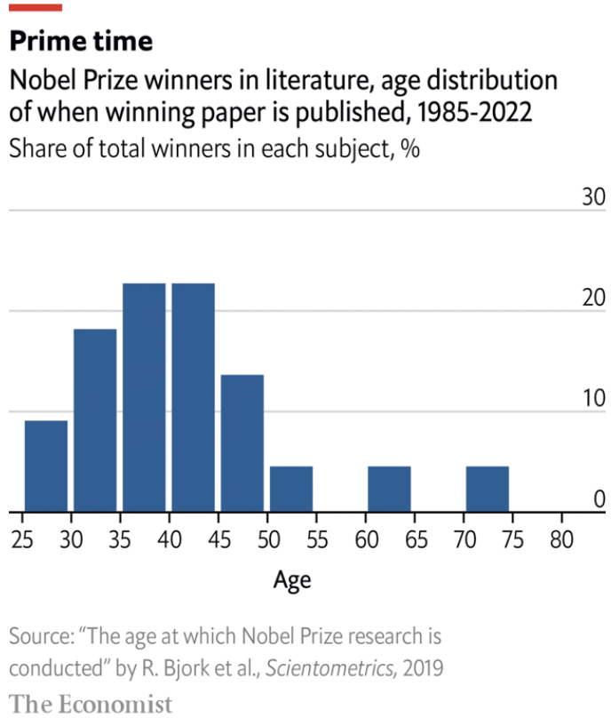

**Evidence from 200 Nobel laureates**

When john goodenough won the Nobel prize in chemistry [in 2019](https://www.economist.com/science-and-technology/2019/10/12/batteries-exoplanets-cosmology-and-cell-biology-win-nobel-laurels) at the age of 97, scientists breathed a sigh of relief. Many had worried that the committee would not get around to honouring his groundbreaking work on lithium-ion batteries from 1980.

Goodenough (who died this year) was the oldest winner of the world’s foremost research prize. Usually laureates are closer to 55 when they pick up the phone to hear the welcome Swedish accent. But it can take years between the publication of a laureate’s career-defining work and recognition from the Nobel committee. At what age are they at the height of their powers?

The answer has changed over time. Science laureates who received the prize between 1901 and 1950 were, on average, 39 years old when they published their winning paper, according to research published in 1957. But a study of more recent Nobel laureates published in 2019 by Rasmus Bjork of the Technical University of Denmark found that science and economics winners were, on average, 44 at the time of their prizewinning work (see chart 1).

Differences between disciplines have lessened. In the first half of the 20th century physicists and chemists were significantly younger when they made their big contributions (at 35 and 38 respectively) than were medical scientists (42). At the time this was attributed to the birth of modern physics at the turn of the century—spurred by new radiation discoveries, the theory of relativity and quantum mechanics—which set the scene for younger scientists to make their mark.

Now, however, the ages of peak achievement in each field are much closer, though physicists still tend to be slightly younger than average. (They make their main contributions at 42 on average, but the distribution skews younger). Physicists need fewer papers to make a big contribution, which may be why they tend to be relatively young when that happens. They usually win Nobels for one big discovery, whereas economists, for example, get them for theories they develop over several years, which pushes up their average age.

Regardless of discipline, future Nobel laureates in science are most productive from late youth to early middle age. Perhaps that is when they find themselves at the sweet intersection of fresh ideas and the means to pursue them. The median age of first-year phd students in the oecd, a club of mainly rich countries, is 29. Promising young researchers who want to start their own labs often get funding around five years after they graduate.

Surprisingly, writers, who depend less on doctoral degrees and grants for lab equipment, also do their best work as they enter middle age. Some Nobel laureates in literature, such as Bob Dylan, were chosen for their contributions over a lifetime. But in cases where the Nobel committee singled out for commendation individual works, the authors’ average age was 41 (see chart 2).

Perhaps people destined to do prizewinning work [become happier](https://www.economist.com/graphic-detail/2019/04/12/do-people-become-happier-after-40), and therefore more creative, as they enter their 40s. Society loves the idea of young talent, but it should celebrate middle-aged talent, too.■

[Source](https://www.economist.com/graphic-detail/2023/10/06/at-what-age-do-you-hit-the-peak-of-your-career)

