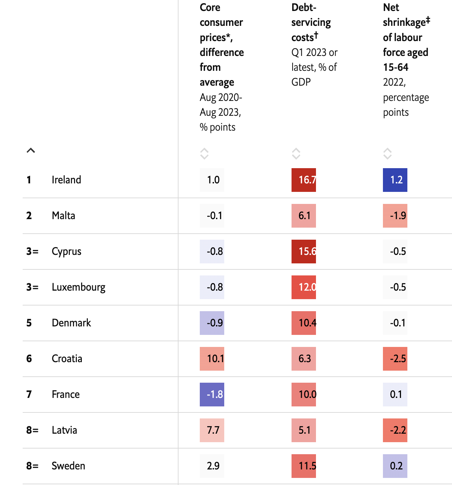

We’ve ranked countries on five measures

The european economies are in for a troubling few years. Germany is probably in recession. The European Commission is forecasting growth of just 0.8% for the eu as a whole in 2023, and little more in 2024. Inflation is coming down only slowly, prompting the European Central Bank (ECB) to raise rates yet again at its September meeting. Business confidence continues to worsen. The commission has asked the ECB’s former boss, Mario Draghi, to come up with a plan to strengthen Europe’s economy. It could make a book, working title: “Whatever it Takes (to Grow)“.

Not all countries are equally affected, though. As our calculations show, they perform differently on the five major challenges that are facing all European economies. Demand will have to be lowered to fight inflation; and the resulting higher rates on debt-piles will weigh against spending. Ageing societies lose workers to retirement faster than youngsters enter the labour market. Meanwhile, the fight against climate change requires industry to transform; and trading with autocracies is increasingly a risk in the new geopolitical age. Welcome to our European economic pentathlon, where we award each country a gold, silver or bronze medal in each of the five disciplines, according to our assessment of their performance.

We start with **demand**. The ecb is required to increase interest rates to bring down inflation. That is not always working according to plan. In Austria annual inflation is still at 5.8%, while it is down to 2.4% in Greece, close to the ecb target of 2%. The same interest rate could thus soon be too low for some, and too high for others. Additionally, the central banks of the seven eu countries that are not in the euro tend to try to ensure that their economies do not get too out of whack with the euro zone. Ideally, inflation in all eu countries should be close to the euro-zone average, even in those outside it. Those whose inflation rate deviates too much from the euro-zone average (currently 4.3%), whether below or above it, will have a costly period of adjustment ahead of them.

Next, **debt**. Higher interest rates will hit countries harder if they already have high public or private borrowing. To make a fair comparison of relative profligacy, we calculate the debt-servicing costs, as a share of gdp, on the total stock of firms’, households’ and governments’ debt as if the rates charged currently on new loans or bonds applied to the whole stock. The reason why that is a fair comparison is that as older debt matures, it will need to be rolled over onto the new rates. Tax havens such as Ireland, Cyprus or Luxembourg have high corporate debt without it affecting the local economy much. But in Hungary, the Scandinavian countries and the Netherlands, private debt servicing is likely to be a drag on consumption, construction and investment. In the Netherlands, a drop in pension assets of households over recent years will add to the problem. In Italy and Greece, it is mostly governments that will soon have to set aside more funds for debt servicing.

Now to **demography**. The struggle with ageing is one of the long-distance disciplines in our pentathlon. Successful countries have in the past stabilised their birth rate, brought in immigrants to enrich their economies, encouraged workers to stay on the job well into their 60s and got men to do their share of care work at home so that women can tap their full economic potential in the labour market.

We measure what countries are now up against. We calculate the net shrinkage of the available labour force, without migration: the number of people aged 60-64, who are close to retirement, minus the youngsters aged 15-19, who are soon entering the labour market. At the bottom are central and eastern European countries, as well as the gerontocracies of the west, Germany and Italy. The number of native workers in Sweden, France or Denmark will remain similarly plentiful in the next few years. Among the eu’s eastern members, Hungary, the Czech Republic and Romania are doing better on this measure than many western eu countries.

The other long-distance race in our economic pentathlon is the **decarbonisation** of the European economy. Greening transport and heating will require hefty investment and should actually boost growth in the short term, as households and governments incur debt to fund new kit. The investment in renewable-energy generation will have a similar effect. Decarbonising industry, however, will be harder, as companies face competition at home and abroad. Until green electricity becomes abundant and cheap, their costs will remain higher. That is even true in countries with nuclear power or lots of renewables: because Europe’s power markets are increasingly connected, prices tend to move in tandem. The overall consumption of gas and electricity by industry, our measure for this challenge, differs widely across Europe as a share of gdp. Within the group of rich countries, Finland and Belgium stand out as large industrial-energy consumers. Spain and Germany are also in the high-energy group, whereas in this discipline Poland and France are lower.

Finally, all countries will face pressure to **decouple** from the world’s autocracies. The eu’s relationship with China in particular will need careful readjustment, to make the continent less vulnerable to economic blackmail. Should a political escalation lead to reduced trade and Chinese retaliation, it is mostly Germany and its big industrial firms, especially its carmakers, with large subsidiaries in China, that stand to lose. But importing from other autocracies also carries risks for supply chains. We calculate the total trade with those countries deemed autocracies by the Economist Intelligence Unit, and divide it by gdp. On this measure, some smaller eu countries do worst. Germany and the Netherlands run in this competition as a joint team, because the port of Rotterdam serves as the import route for many German customers, too, and Dutch trade figures tend to be overstated. They rank highest among larger countries, with France close to the lower end of the table.

(Here is a giant table, please reference to [the original post](https://www.economist.com/europe/2023/10/12/our-european-economic-pentathlon).)

[Source](https://www.economist.com/europe/2023/10/12/our-european-economic-pentathlon)
