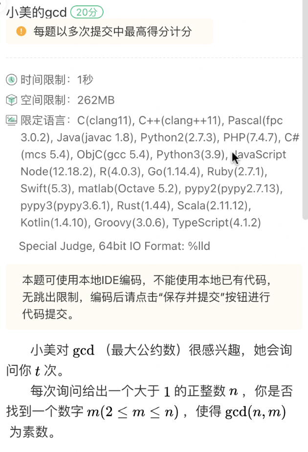
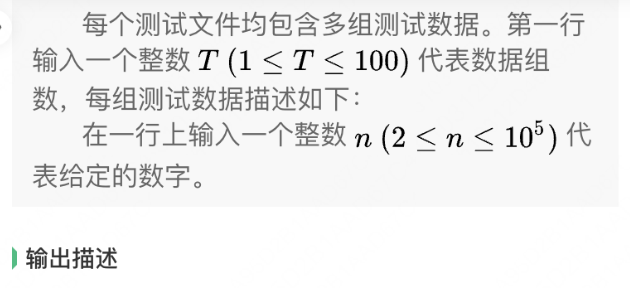
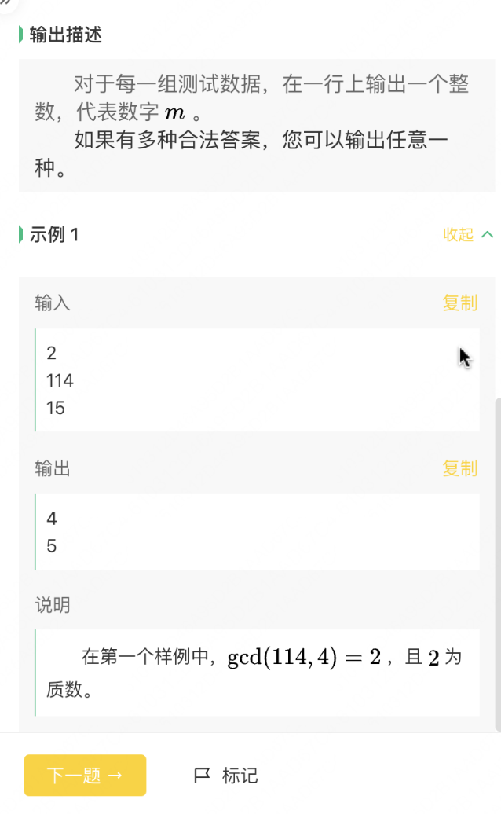
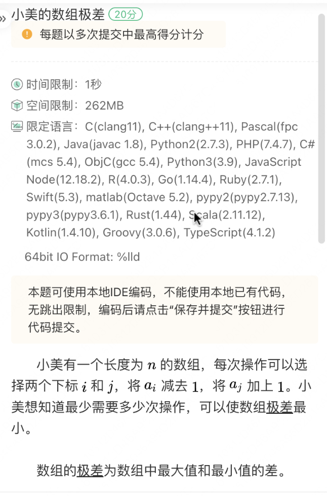

2024 年 8 月 17 日 19:00 - 20:30，美团2024年秋招第二场笔试。


总限时 90 分钟，共 100 分。


10道选择题，三道算法题


编程题使用 ACM 模式，即需要自己处理输入输出。语言不限，**可以**用本地IDE。


*Note: 试题回忆 / OCR 可能有错漏，且我的思路及解法较为笨拙，不敢保证正确性。*


抛砖引玉，敬请指正。


## 算法题

### Q1 小美的gcd







#### My Solution

简单模拟，通过100%

```python
from math import sqrt, gcd
from functools import cache


@cache
def my_gcd(x: int, y: int):
    return gcd(x, y)


@cache
def prime(x: int):
    if x <= 1:
        return False
    for i in range(2, int(sqrt(x)) + 1):
        if x % i == 0:
            return False
    return True


def answer1(n: int) -> int:
    if prime(n):
        return n
    for m in range(2, n + 1):
        if prime(my_gcd(n, m)):
            return m


T = int(input())
for _ in range(T):
    n = int(input())
    print(answer1(n))
```


### Q2 小美的数组极差



#### My Solution

根据n、k的奇偶性分四类讨论。通过100%。

```python
n, k = map(int, input().split())
s = input().strip()
ans = ''
if n % 2 == 0:
    if k % 2 == 0:
        ans = s[k - 1:] + s[:k - 1][::-1]
    else:
        ans = s[k - 1:] + s[:k - 1]
else:
    if k % 2 != 0:
        ans = s[k - 1:] + s[:k - 1][::-1]
    else:
        ans = s[k - 1:] + s[:k - 1]
print(ans)
```


### Q3 小红的树上染色 25 pts

小红有一棵树，节点编号从1到n。第i个节点的权值为ai。

小红需要将一个所有节点编号均小于等于 x 的连通块染红，使得连通块的节点权值和尽可能大，小红需要求出最大的权值和。

小红觉得这题太简单了，因此她会询问 n 次，将 x 按1到n的顺序各询问一次，请求出每次询问的答案。


**输入描述**

第一行输入一个正整数n，表示节点数量。

第二行输入n个正整数a_i，代表每个节点的权值。

接下来的 n-1 行，每行输入两个正整数 u 和 v，代表节点u和节点v有一条无向边相连。

1 ≤ n ≤ 10^5

1 ≤ a_i ≤ 10^9

**输出描述**

输出n行，第 i 行代表 x=i 时的问题答案。

**示例 1**

**输入**

```
5
2 3 1 7 2
1 2
1 3
2 5
4 5
```

**输出**

```
2
5
6
7
15
```

**说明**

```
X=1时，只染红1号节点即可。
x=2时，染红1、2号节点。
X=3时，染红1、2、3号节点。
x=4时，只染红4号节点。
x=5时，可以全部染红。
```


#### My Solution

题目都没看懂，没做。

```python
# TODO
```

#### Correct Solution

```python
# TODO
```

