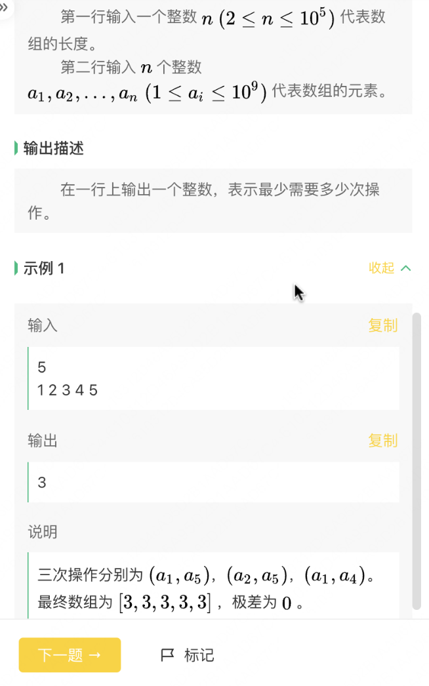
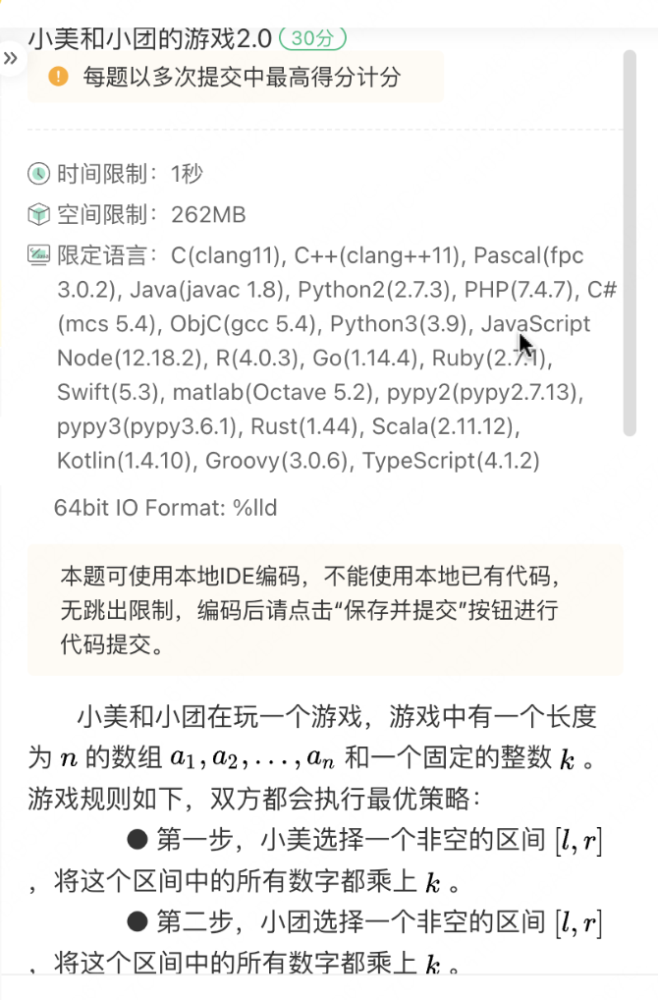
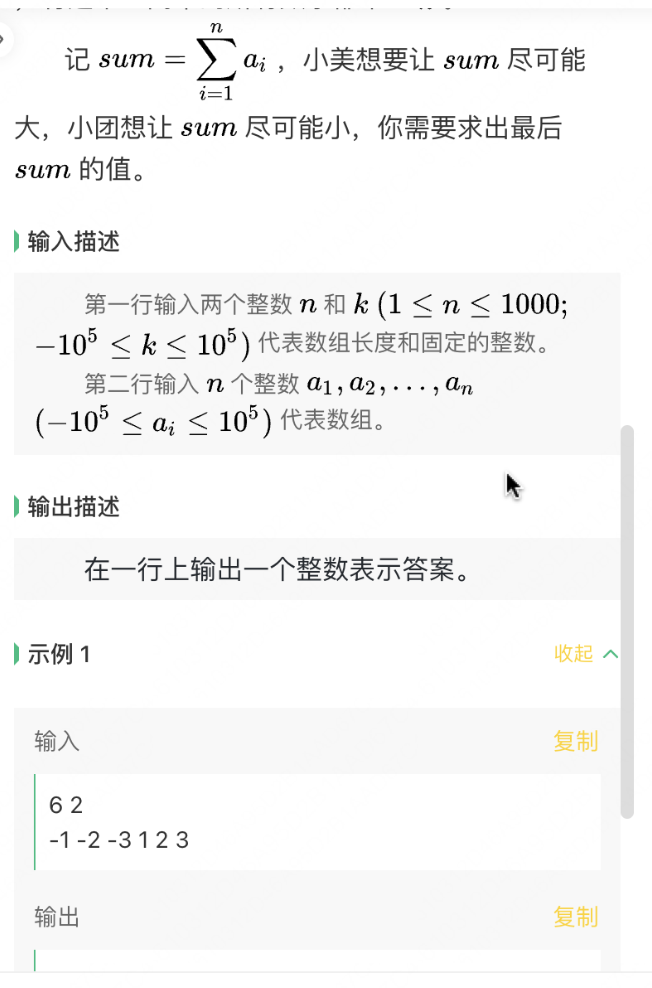
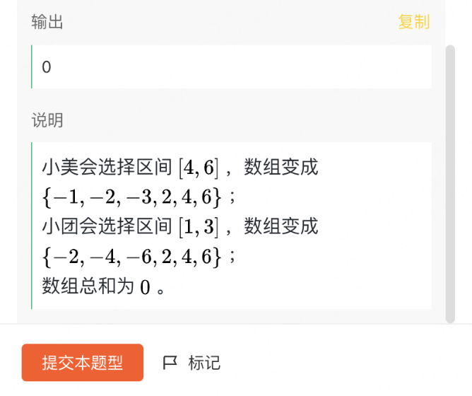

2024 年 8 月 17 日 19:00 - 20:30，美团2024年秋招第二场笔试。


总限时 90 分钟，共 100 分。


10道选择题，三道算法题


编程题使用 ACM 模式，即需要自己处理输入输出。语言不限，**可以**用本地IDE。


*Note: 试题回忆 / OCR 可能有错漏，且我的思路及解法较为笨拙，不敢保证正确性。*


抛砖引玉，敬请指正。


## 算法题

### Q1 小美的gcd


#### My Solution

简单模拟，通过100%

```python
from math import sqrt, gcd
from functools import cache


@cache
def my_gcd(x: int, y: int):
    return gcd(x, y)


@cache
def prime(x: int):
    if x <= 1:
        return False
    for i in range(2, int(sqrt(x)) + 1):
        if x % i == 0:
            return False
    return True


def answer1(n: int) -> int:
    if prime(n):
        return n
    for m in range(2, n + 1):
        if prime(my_gcd(n, m)):
            return m


T = int(input())
for _ in range(T):
    n = int(input())
    print(answer1(n))
```


### Q2 小美的数组极差




#### My Solution

不会做，通过10%。

```python
n = int(input())
arr = list(map(int, input().split()))
mean = sum(arr) / n
mean_l = int(mean)
ans = 0
if mean_l != mean:
    mean_r = mean_l + 1
    ans_l = ans_r = 0
    for num in arr:
        if num < mean_l:
            ans_l += (mean_l - num)
        if num > mean_r:
            ans_r += (num - mean_r)
    ans = min(ans_l, ans_r)
else:
    mean = int(mean)
    for num in arr:
        if num < mean:
            ans += (mean - num)
print(ans)
```

#### Correct Solution

```python
# TODO
```


### Q3 小美和小团的游戏2.0







#### My Solution

```python
# TODO
```

#### Correct Solution

```python
# TODO
```

