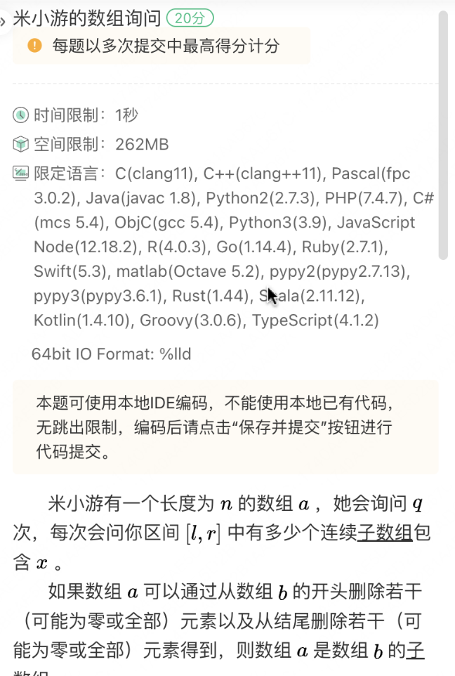

2024 年 8 月 17 日 20:00 - 22:00，2025届秋招-米哈游程序通卷-B卷


总限时 120 分钟，共 100 分。


10道单选，15道不定项选择，三道算法题


编程题使用 ACM 模式，即需要自己处理输入输出。语言不限，**可以**用本地IDE。


*Note: 试题回忆 / OCR 可能有错漏，且我的思路及解法较为笨拙，不敢保证正确性。*


抛砖引玉，敬请指正。


## 算法题

### Q1 米小游的原石计划


#### My Solution

简单模拟，通过100%

```python
# MiHoYo Q1
from math import ceil

n, m = map(int, input().split())
# n, m = 3200, 35
month_card = ceil(n / 3000)
ans = ceil(n / 10)
for i in range(month_card + 1):
    money = i * 30
    need_stones = n - 300 * i
    need_stones -= 90 * min(m, i * 30)

    if need_stones <= 0:
        ans = min(ans, money)
        continue
    money += ceil(need_stones / 10)
    ans = min(ans, money)
print(ans)
```


### Q2 米小游种树（一）


#### My Solution

不会做，骗分通过70%。

```python
# MiHoYo Q2
import random

n, m = map(int, input().split())
ans = [m - 2, m - 1, m]  # 40%, 50%, 10%

print(random.sample(ans, 1)[0])
# for tree in range(1, n + 1):
#     ...
```

#### Correct Solution

```python
# TODO
```


### Q3 米小游的数组询问




#### My Solution

```python
# TODO
```

#### Correct Solution

```python
# TODO
```

