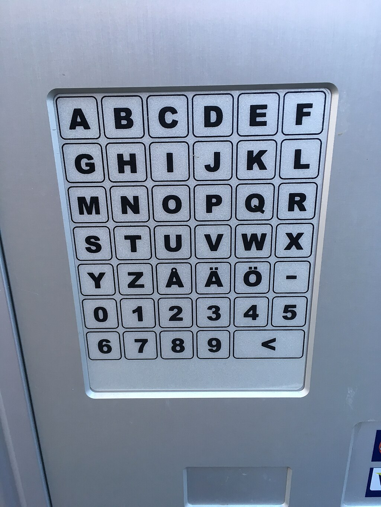
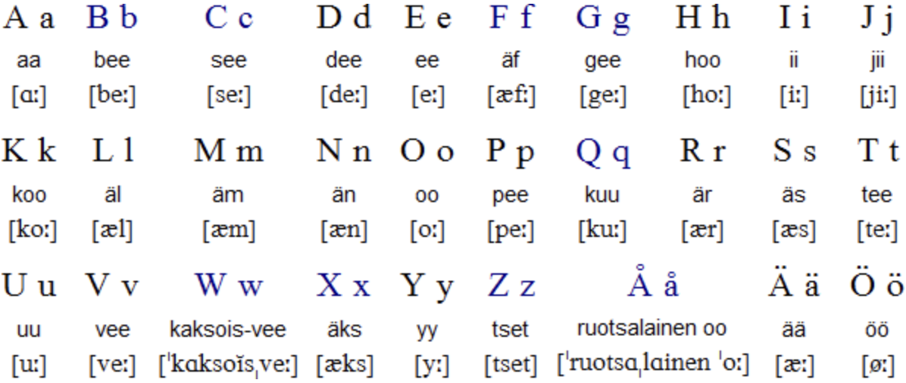
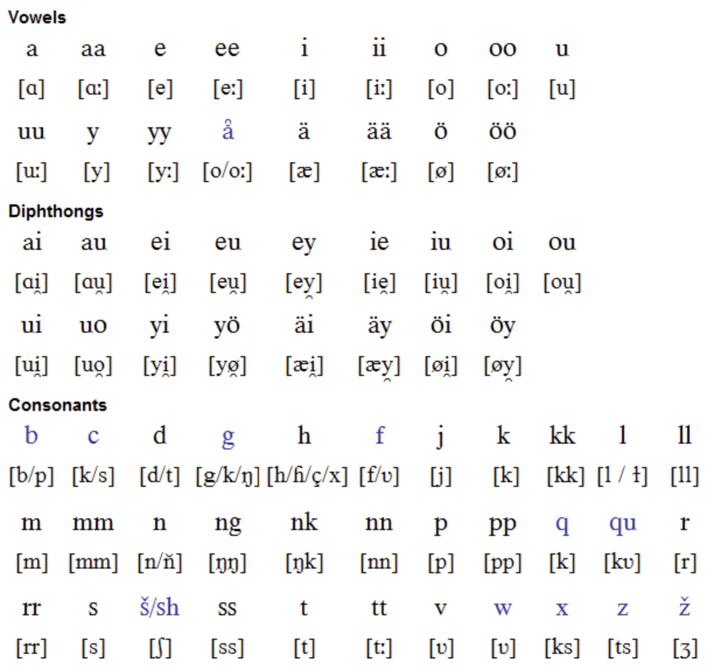

Finnish (endonym: suomi [ˈsuo̯mi] or suomen kieli [ˈsuo̯meŋ ˈkie̯li]) is a Uralic language of the Finnic branch, spoken by the majority of the population in Finland and by ethnic Finns outside of Finland.

## Finnish Alphabet

The following table describes how each letter in the Finnish alphabet (Finnish: Suomen aakkoset) is spelled and pronounced separately. If the name of a consonant begins with a vowel (usually ä [æ]), it can be pronounced and spelled either as a monosyllabic or bisyllabic word.[1] In practice, the names of the letters are rarely spelled, as people usually just type the (uppercase or lowercase) glyph when they want to refer to a particular letter.

The pronunciation instructions enclosed in slashes are broad transcriptions based on the IPA system. In notes, more narrow transcriptions are enclosed in square brackets.

|                 Glyphs                  |           Name            |          Name pronunciation           |                                                                                                                                                                                                                          Notes on usage (for more, see [Finnish phonology](https://en.wikipedia.org/wiki/Finnish_phonology))                                                                                                                                                                                                                           |
| :-------------------------------------: | :-----------------------: | :-----------------------------------: | :----------------------------------------------------------------------------------------------------------------------------------------------------------------------------------------------------------------------------------------------------------------------------------------------------------------------------------------------------------------------------------------------------------------------------------------------------------------------------------------------------------------------------------------------------: |
| [A](https://en.wikipedia.org/wiki/A), a |           _aa_            |                 /ɑː/                  |                                                                                                                                                                                                                                                                                                                                                                                                                                                                                                                                                        |
| [B](https://en.wikipedia.org/wiki/B), b |           _bee_           |                 /beː/                 |                                                                                                                                                                           Occurs in relatively new loanwords, such as _banaani_ '[banana](https://en.wikipedia.org/wiki/Banana)' and _bussi_ '[bus](https://en.wikipedia.org/wiki/Bus)'. Typically pronounced as [b̥] or [p].                                                                                                                                                                           |
| [C](https://en.wikipedia.org/wiki/C), c |           _see_           |                 /seː/                 |                                                                                                                                                                                  Occurs in unestablished loanwords, such as _[curry](https://en.wikipedia.org/wiki/Curry)_ and _[cesium](https://en.wikipedia.org/wiki/Cesium)_. Typically pronounced as [k] or [s].                                                                                                                                                                                   |
| [D](https://en.wikipedia.org/wiki/D), d |           _dee_           |                 /deː/                 |                                                                                                                                                                In present standard language, _d_ stands for [d], but it may be pronounced as [d̥] or [t̪], and the pronunciation in dialects varies greatly. Natively used in Western dialects as [ɾ] and not at all in Eastern dialects.                                                                                                                                                                |
| [E](https://en.wikipedia.org/wiki/E), e |           _ee_            |                 /eː/                  |                                                                                                                                                                                                                                               The precise pronunciation tends to be between [e] and [ɛ].                                                                                                                                                                                                                                               |
| [F](https://en.wikipedia.org/wiki/F), f |       _äf_, _äffä_        |   /æf/, /ˈæf.fæ/, occasionally /ef/   |                Occurs in relatively new loanwords, such as _asfaltti_ '[asphalt](https://en.wikipedia.org/wiki/Bitumen)' or _uniformu_ '[uniform](https://en.wikipedia.org/wiki/Uniform)'. Historically and in dialectal pronunciation (apart from some Western dialects), /f/ is typically replaced with /ʋ/ or medially /hʋ/ (e.g. _kahvi_ /ˈkah.ʋi/ ← Swedish _kaffe_ '[coffee](https://en.wikipedia.org/wiki/Coffee)'). Even newer loanwords may have an alternative spelling where _v_ has replaced _f_ (_asvaltti_, _univormu_).                 |
| [G](https://en.wikipedia.org/wiki/G), g |           _gee_           |                 /ɡeː/                 |                                                                    Occurs natively in the [digraph _ng_](<https://en.wikipedia.org/wiki/Ng_(digraph)>), which marks the long [velar nasal](https://en.wikipedia.org/wiki/Velar_nasal) [ŋː] (with no [ɡ] sound). Otherwise _g_ only occurs in relatively new loanwords, such as _gaala_ '[gala](https://en.wikipedia.org/wiki/Festival)' and _geeni_ '[gene](https://en.wikipedia.org/wiki/Gene)'. Typically pronounced [ɡ̊] or [k].                                                                     |
| [H](https://en.wikipedia.org/wiki/H), h |           _hoo_           |                 /hoː/                 |                                                                                                                                                  Normally a voiceless [fricative](https://en.wikipedia.org/wiki/Fricative), but the precise pronunciation depends on the preceding vowel; between two vowels may be pronounced as [breathy-voiced](https://en.wikipedia.org/wiki/Breathy_voice) [ɦ].                                                                                                                                                   |
| [I](https://en.wikipedia.org/wiki/I), i |           _ii_            |                 /iː/                  |                                                                                                                                                                                                                                                                          [i]                                                                                                                                                                                                                                                                           |
| [J](https://en.wikipedia.org/wiki/J), j |           _jii_           |                 /jiː/                 |                                                                                                                                                                  Without exception [j] (English consonant _y_), as in German and Swedish, never [fricative](https://en.wikipedia.org/wiki/Fricative) or [affricate](https://en.wikipedia.org/wiki/Affricate) as in French or English.                                                                                                                                                                  |
| [K](https://en.wikipedia.org/wiki/K), k |           _koo_           |                 /koː/                 |                                                                                                                                                                                                                                                                                                                                                                                                                                                                                                                                                        |
| [L](https://en.wikipedia.org/wiki/L), l |       _äl_, _ällä_        |   /æl/, /ˈæl.læ/, occasionally /el/   |                                                                                                                                                                                                                                                                                                                                                                                                                                                                                                                                                        |
| [M](https://en.wikipedia.org/wiki/M), m |       _äm_, _ämmä_        |   /æm/, /ˈæm.mæ/, occasionally /em/   |                                                                                                                                                                                                                                                                                                                                                                                                                                                                                                                                                        |
| [N](https://en.wikipedia.org/wiki/N), n |       _än_, _ännä_        |   /æn/, /ˈæn.næ/, occasionally /en/   |                                                                                                                                                                                                                                                                                                                                                                                                                                                                                                                                                        |
| [O](https://en.wikipedia.org/wiki/O), o |           _oo_            |                 /oː/                  |                                                                                                                                                                                                                                               The precise pronunciation tends to be between [o] and [ɔ].                                                                                                                                                                                                                                               |
| [P](https://en.wikipedia.org/wiki/P), p |           _pee_           |                 /peː/                 |                                                                                                                                                                                                                                                                                                                                                                                                                                                                                                                                                        |
| [Q](https://en.wikipedia.org/wiki/Q), q |           _kuu_           |                 /kuː/                 |                                                                                                                                                        Mainly occurs in foreign proper names (in loanwords [digraph](<https://en.wikipedia.org/wiki/Digraph_(orthography)>) _qu_ has often been replaced with _kv_). Typically pronounced as [k], though some speakers mispronounce it as [ɡ].                                                                                                                                                         |
| [R](https://en.wikipedia.org/wiki/R), r |       _är_, _ärrä_        |   /ær/, /ˈær.ræ/, occasionally /er/   |                                                                                                                                                                                                                                                                                                                                                                                                                                                                                                                                                        |
| [S](https://en.wikipedia.org/wiki/S), s |       _äs_, _ässä_        |   /æs/, /ˈæs.sæ/, occasionally /es/   |                                                                                                                                                                                                                                                                                                                                                                                                                                                                                                                                                        |
| [T](https://en.wikipedia.org/wiki/T), t |           _tee_           |                 /teː/                 |                                                                                                                                                                                    The precise pronunciation tends to be [dental](https://en.wikipedia.org/wiki/Dental_consonant) [t̪] rather than [alveolar](https://en.wikipedia.org/wiki/Alveolar_consonant) [t].                                                                                                                                                                                    |
| [U](https://en.wikipedia.org/wiki/U), u |           _uu_            |                 /uː/                  |                                                                                                                                                                                                                                               The precise pronunciation tends to be between [u] and [o].                                                                                                                                                                                                                                               |
| [V](https://en.wikipedia.org/wiki/V), v |           _vee_           |                 /ʋeː/                 |                                                                                                                                                                                               Typically pronounced as [approximant](https://en.wikipedia.org/wiki/Approximant) [ʋ] rather than [fricative](https://en.wikipedia.org/wiki/Fricative) [v].                                                                                                                                                                                               |
| [W](https://en.wikipedia.org/wiki/W), w | _kaksois-vee_ _tupla-vee_ | /ʋeː/, /ˈkɑk.soisˌʋeː/, /ˈtup.lɑˌʋeː/ | The "double-v" may occur natively as an archaic variant of _v_, but otherwise in unestablished loanwords and foreign proper names only. It occurs in some rare surnames such as _Waltari_ (e.g. [Mika Waltari](https://en.wikipedia.org/wiki/Mika_Waltari), a world-famous author) or in some rare first names such as _Werner_ (e.g. [Werner Söderström](https://en.wikipedia.org/wiki/Sanoma), a well-known publisher). In [collation](https://en.wikipedia.org/wiki/Collation) the letter _w_ is treated mostly like _v_. Typically pronounced [ʋ]. |
| [X](https://en.wikipedia.org/wiki/X), x |       _äks_, _äksä_       |  /æks/, /ˈæk.sæ/, occasionally /eks/  |                                                                                                     Occurs in unestablished loanwords, such as _[taxi](https://en.wikipedia.org/wiki/Taxicab)_ or _[fax](https://en.wikipedia.org/wiki/Fax)_, but there is often a preferred alternative where _x_ has been replaced with [digraph](<https://en.wikipedia.org/wiki/Digraph_(orthography)>) _ks_ (_taksi_, _faksi_). Typically pronounced as [ks].                                                                                                      |
| [Y](https://en.wikipedia.org/wiki/Y), y |           _yy_            |                 /yː/                  |                                                                                                                                                                                                                                               The precise pronunciation tends to be between [y] and [ø].                                                                                                                                                                                                                                               |
| [Z](https://en.wikipedia.org/wiki/Z), z |      _tset_, _tseta_      |  /tset/, /ˈtse.tɑ/, /zet/, /ˈze.tɑ/   |                                                                                                                  Occurs in unestablished loanwords, such as _zeniitti_ /tse.niːt.ti/ '[zenith](https://en.wikipedia.org/wiki/Zenith)' or _[pizza](https://en.wikipedia.org/wiki/Pizza)_, but there may be an alternative spelling with _ts_ (e.g. _pitsa_). Typically pronounced [ts] (like in German), but sometimes as [dz] or [z].                                                                                                                  |
| [Å](https://en.wikipedia.org/wiki/Å), å |     _ruotsalainen oo_     |      /oː/, /ˈruot.sɑˌlɑi.nen oː/      |                                                             The "Swedish _o_", carried over from the [Swedish alphabet](https://en.wikipedia.org/wiki/Swedish_alphabet) and redundant in Finnish; retained especially for writing [Finland-Swedish](https://en.wikipedia.org/wiki/Finland-Swedish) proper names (such as [Ståhlberg](https://en.wikipedia.org/wiki/Kaarlo_Juho_Ståhlberg)). All Finnish words containing _å_ are names; there it is pronounced [oː] (identically to _oo_).                                                             |
| [Ä](https://en.wikipedia.org/wiki/Ä), ä |           _ää_            |                 /æː/                  |                                                                                                                                                                                                                                                                                                                                                                                                                                                                                                                                                        |
| [Ö](https://en.wikipedia.org/wiki/Ö), ö |           _öö_            |                 /øː/                  |                                                                                                                                                                                                                                               The precise pronunciation tends to be between [ø] and [œ].                                                                                                                                                                                                                                               |

## Finnish Pronunciation

Finnish vowel harmony is an essential aspect of the language that affects not only the sound but also the meaning of words. The two classes of vowels, front and back vowels, must match within a word. For instance, in the word "koti" (home), both vowels "o" and "i" are back vowels, while in the word "keittiö" (kitchen), the first vowel "e" is a front vowel, and the second vowel "i" is also a front vowel. Paying attention to vowel harmony is crucial when learning to speak Finnish, as using the wrong type of vowel can lead to miscommunication. In addition to vowel harmony, Finnish has other unique pronunciation characteristics. For example, Finnish is syllable-timed, meaning that each syllable is pronounced with the same amount of time, giving the language a rhythmic and melodic quality. Furthermore, the stress in Finnish always falls on the first syllable of a word. English speakers may find some Finnish sounds challenging to master, such as the rolled "r" sound and the "l" sound pronounced by touching the tongue to the roof of the mouth. Additionally, Finnish has five diphthongs made up of two vowel sounds pronounced together as one sound, such as "ai," "ei," "oi," "ui," and "yi." Learning to correctly pronounce these sounds is important to improve one's spoken Finnish.

- "Koti" - "Koh-tee"
- "Keittiö" - "Kayt-tee-oh"
- "Kissat" - "Kiss-aht"
- "Mökki" - "Merk-kee"
- "Sisko" - "Sis-koh"
- "Yö" - "Yuh"
