## Abstract

The database-as-a-service paradigm in the cloud (DBaaS) is becoming increasingly popular. Organizations adopt this paradigm because they expect higher security, higher avail- ability, and lower and more flexible cost with high perfor- mance. It has become clear, however, that these expectations cannot be met in the cloud with the traditional, monolithic database architecture. This paper presents a novel DBaaS architecture, called Socrates. Socrates has been implemented in Microsoft SQL Server and is available in Azure as SQL DB Hyperscale. This paper describes the key ideas and features of Socrates, and it compares the performance of Socrates with the previous SQL DB offering in Azure.

[Socrates: The New SQL Server in the Cloud](https://doi.org/10.1145/3299869.3314047)

## My simple slides

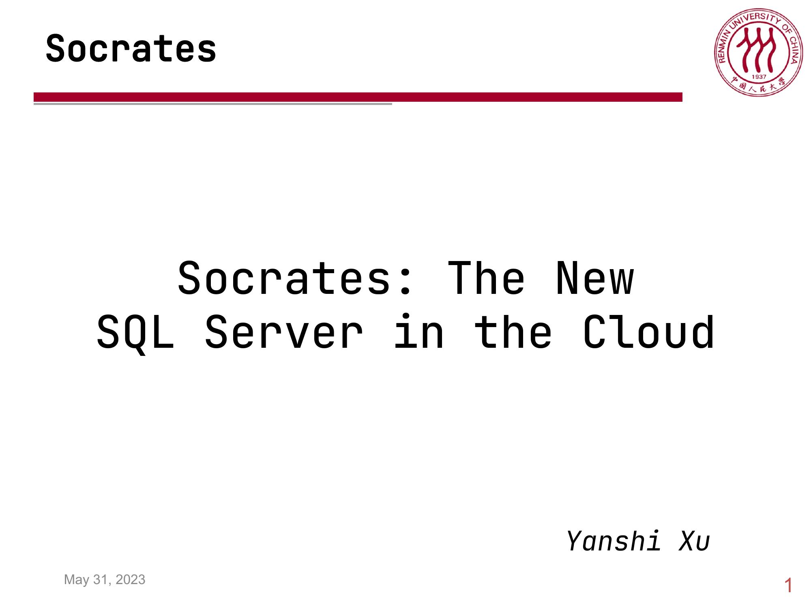
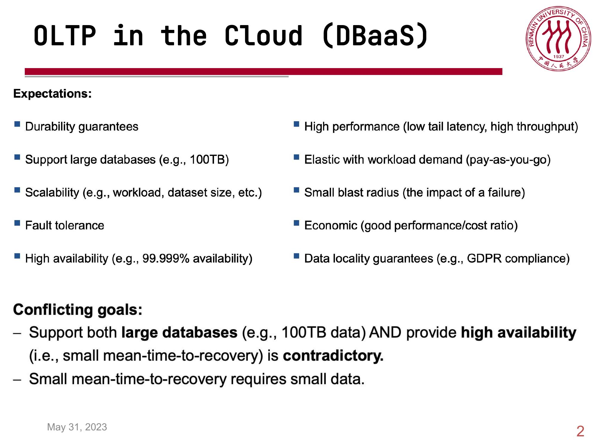
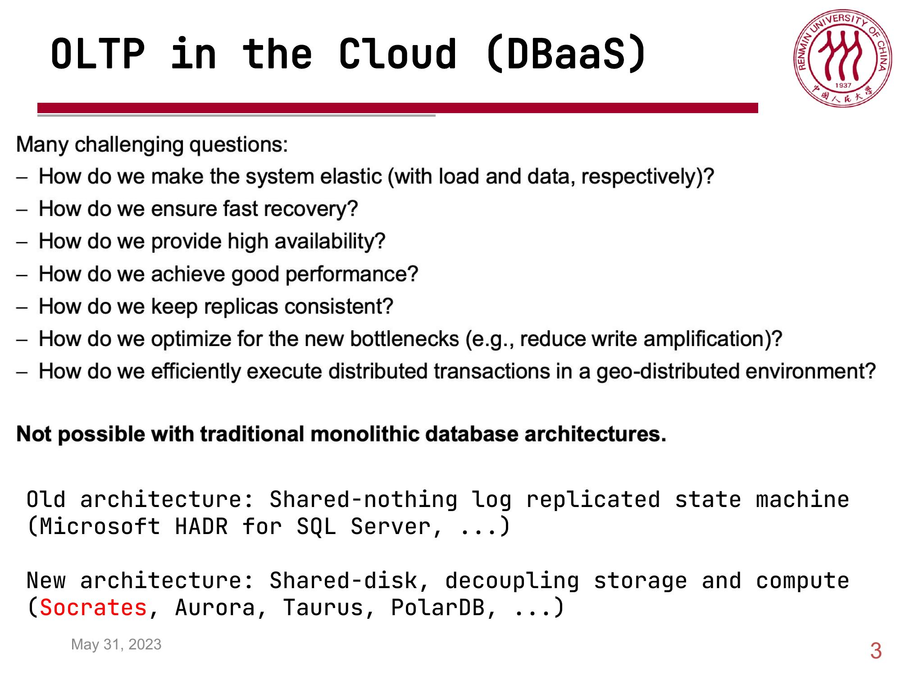
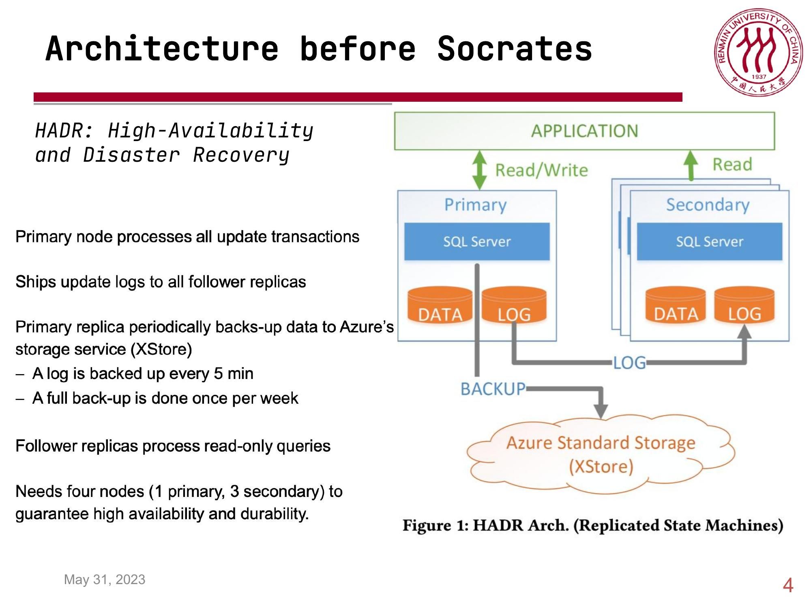
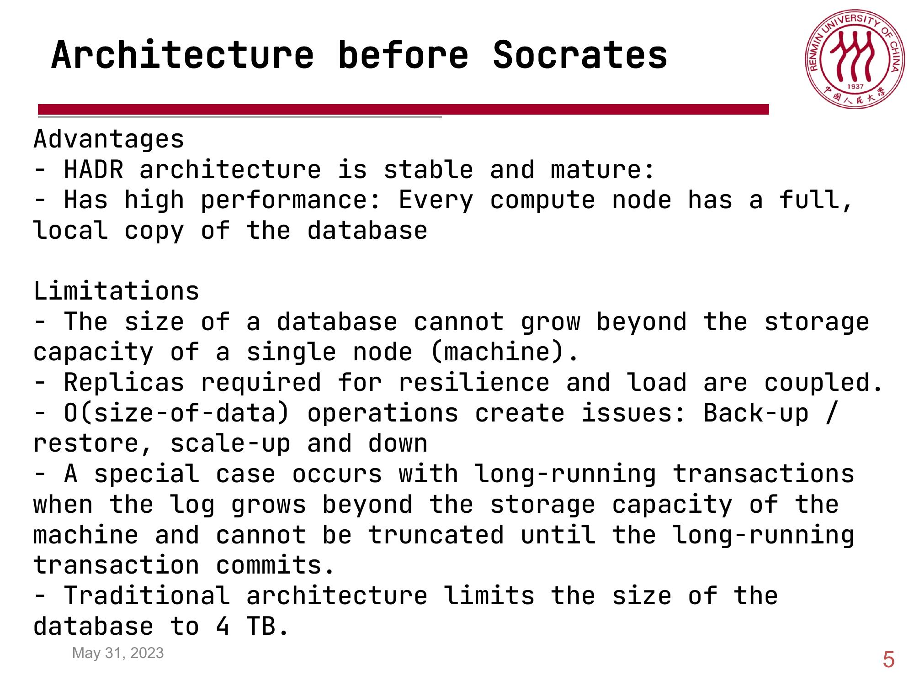
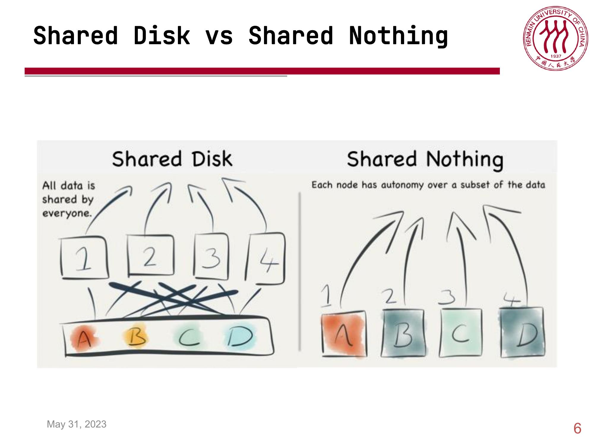
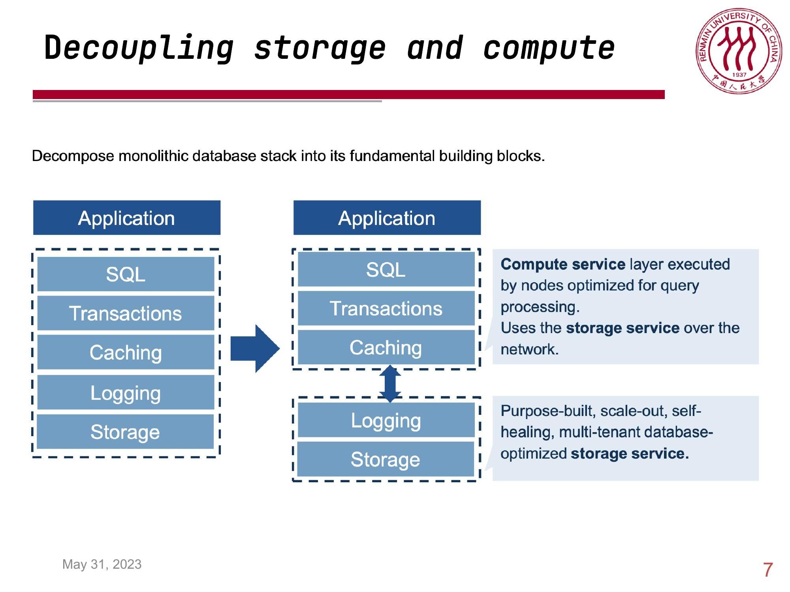
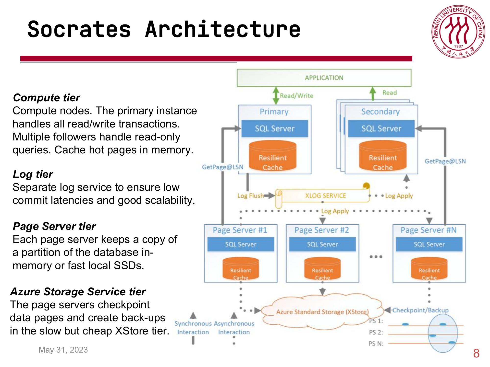
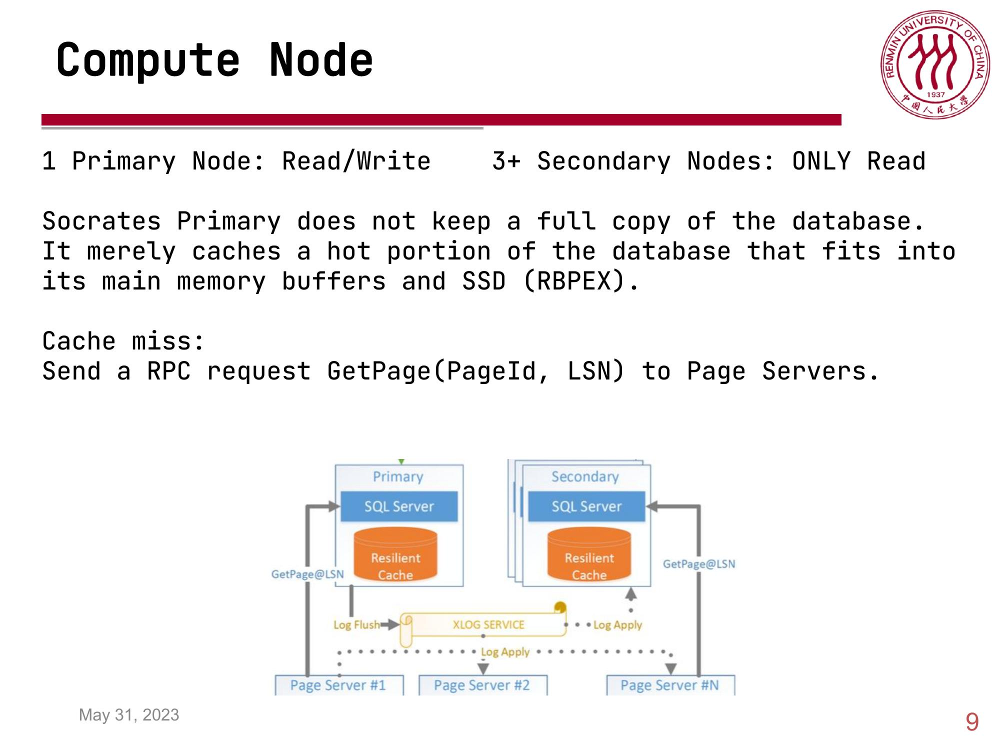
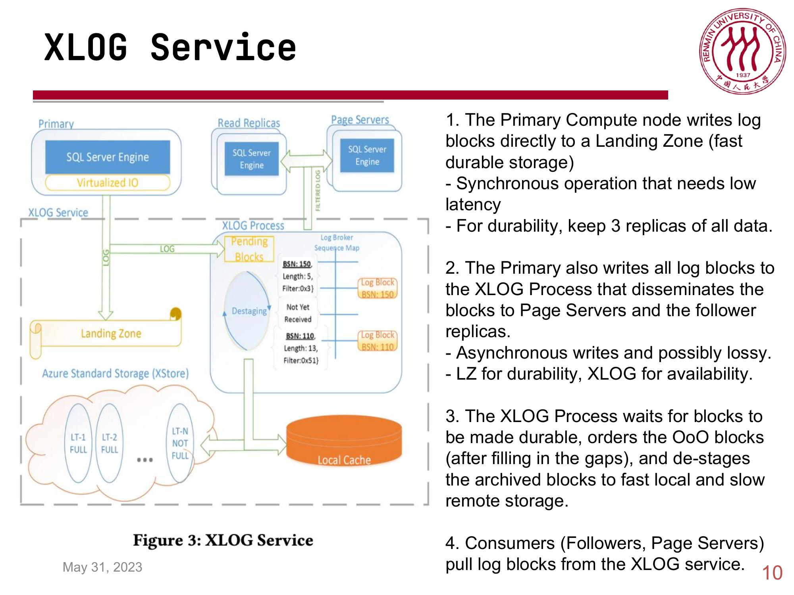
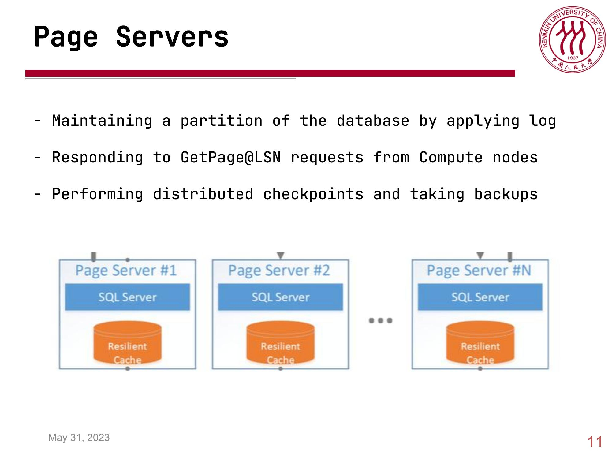
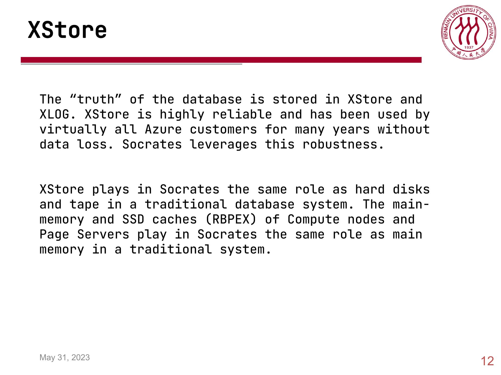
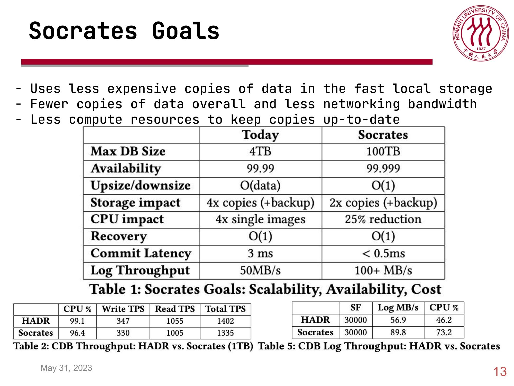
